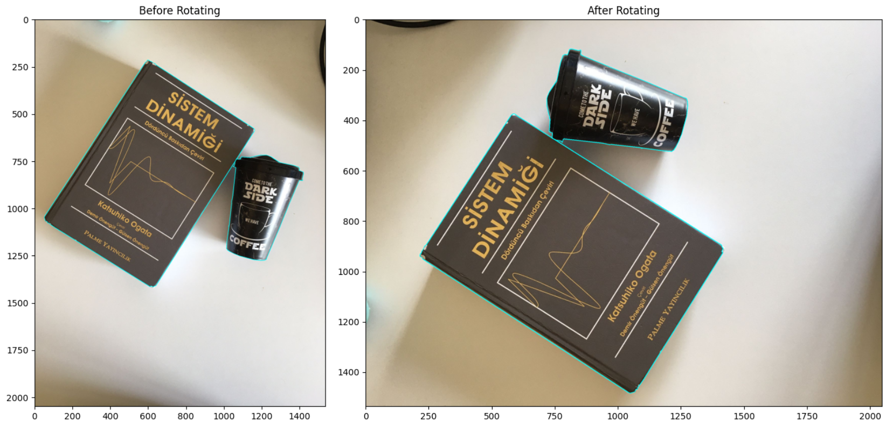

# Rotating Yolo-Type Annotations

**Rotating segmentation annotations and images of type Yolo.** In case you want to rotate images and segmentation annotations, you can use this repo. ~~It also works with bounding boxes.~~



## How to Use

Edit `rotate_dataset.py` for dataset path, and run the code. It will create new dataset folder named with `{your_dataset_path}_rotated` and its subfolders (train, test, val)/(images/labels). 

- Notebooks can be examined to see how the codes work.

```bash
python rotate_dataset.py
```

- Also, this generates annotated images each train/test/val folders with `test_images` name.
```
├───train
│   ├───images
│   │       vertical_1.jpg
│   │       vertical_2.jpg
│   │
│   ├───labels
│   │       vertical_1.txt
│   │       vertical_2.txt
│   │
│   └───test_images
│           vertical_1.jpg
│           vertical_2.jpg
```
# TODO

- [ ] Fix for object detection dataset rotation.